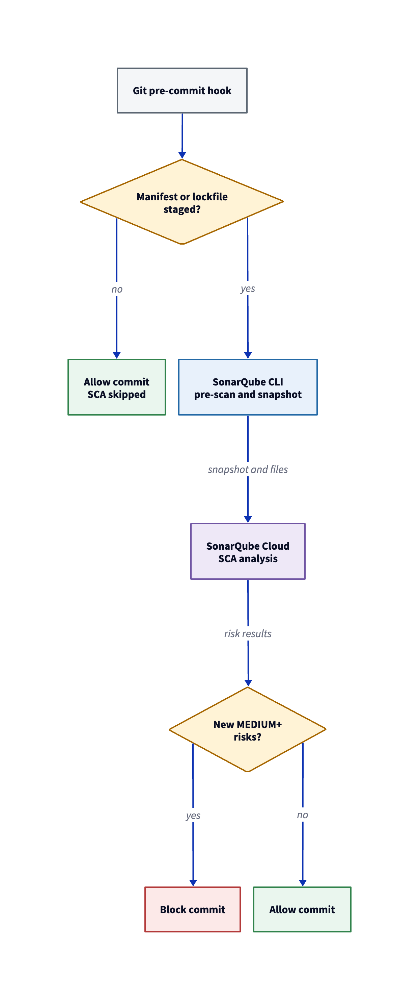
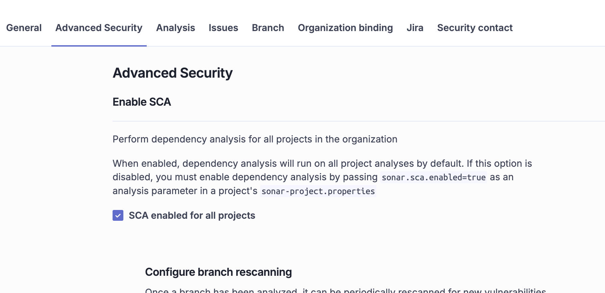
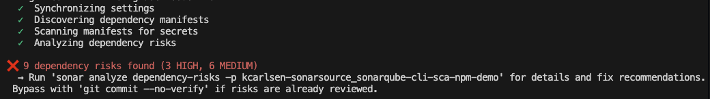

# Catch vulnerable dependencies at commit with the SonarQube CLI

> Last updated: July 2026
>
> This private preservation package retains demo output captured with SonarQube CLI 1.3.0 and SonarQube Cloud on 2026-07-14. Results, commands, plan requirements, and entitlements may differ by release, project, organization, and configuration. Check the linked current product documentation before applying these instructions to a live environment.

## TL;DR

- The SonarQube CLI’s pre-commit hook can run dependency-risk analysis at commit time, blocking newly introduced MEDIUM, HIGH, or BLOCKER vulnerability, malware, and prohibited-license risks before they enter local history.
- The hook skips dependency-risk analysis when only application code changed, while secrets detection still runs.
- Dependency discovery happens locally, while SonarQube Cloud evaluates the uploaded dependency snapshot, manifests, and lockfiles against vulnerability, malware, and license-risk data.
- Risk results can include CVE identifiers, severity, and recommended versions for vulnerability risks, with support for npm, Python, and other ecosystems supported by SonarQube SCA.

## Overview

This blueprint sets up dependency-risk scanning with the [SonarQube CLI](https://docs.sonarsource.com/sonarqube-cli/) so that a pre-commit hook blocks vulnerable packages before they enter your repository. By the end, your Git workflow will analyze staged manifest and lockfile changes against [SonarQube Cloud](https://www.sonarsource.com/products/sonarqube/cloud/), reject commits that introduce new risks at MEDIUM severity or higher, and skip dependency-risk analysis when nothing dependency-related changes. The primary example uses npm with `package.json` and `package-lock.json`, while a secondary section covers Python `requirements.txt` to show where ecosystem differences affect the setup.

## When to use this

You want local, per-commit feedback on dependency risks without waiting for CI results, and your organization already has a SonarQube Cloud project with [SonarQube Advanced Security](https://www.sonarsource.com/plans-and-pricing/sonarcloud/) enabled. This setup works well when your team uses the SonarQube CLI for secrets scanning or agentic analysis and wants to extend that same pre-commit hook to cover dependencies.

## What you'll achieve

- Terminal-based dependency-risk analysis that reports vulnerabilities, malware, and license risks from SonarQube Cloud
- A pre-commit hook that blocks commits introducing new dependency risks at MEDIUM, HIGH, or BLOCKER severity
- Dependency-risk analysis skips when no manifests or lockfiles changed, while secrets detection still runs
- Fail-open behavior that lets commits proceed when network or infrastructure problems prevent the SCA stage from completing

## Architecture



The SonarQube CLI uses a hybrid architecture where dependency discovery and secrets pre-scanning happen locally while risk analysis runs server-side. When you run `sonar analyze dependency-risks` or trigger the pre-commit hook, the CLI discovers manifest and lockfile inputs in your working tree, scans them for hardcoded secrets, and resolves a dependency snapshot using the local `sca-scanner-cli` binary. That snapshot and the dependency files are uploaded to SonarQube Cloud for analysis, while source code stays on your machine.

SonarQube Cloud applies the project's SCA settings, runs risk analysis against its vulnerability, malware, and license databases, and returns the results with status, severity, CVE data, and remediation recommendations. The pre-commit hook filters that analysis further because it fires only when staged files include dependency manifests or lockfiles and blocks the commit only when the results contain risks that are both newly introduced and at MEDIUM severity or higher. A commit that changes only application code skips the SCA stage entirely.

## Prerequisites

- [SonarQube CLI](https://docs.sonarsource.com/sonarqube-cli/) 1.3.0 or later, installed and authenticated (`sonar auth login`)
- A [SonarQube Cloud](https://www.sonarsource.com/products/sonarqube/cloud/) organization on a [plan that includes SonarQube Advanced Security](https://www.sonarsource.com/plans-and-pricing/sonarcloud/), with SCA enabled on the target project
- An existing SonarQube Cloud project bound to your repository (the CLI does not create projects)
- npm and Node.js for the primary example
- Python 3 and pip for the secondary example (Step 7 only)
- A Git repository with a committed `package-lock.json`, because npm lockfiles provide exact resolved versions and a complete dependency graph that SCA needs for accurate results
- Network access to SonarQube Cloud and to `binaries.sonarsource.com` for the first-run scanner binary download

Commands and output in this blueprint were captured with SonarQube CLI 1.3.0 against SonarQube Cloud on 2026-07-14.

## Step 1 — Authenticated CLI connected to your project

Verify that the CLI can reach your SonarQube Cloud organization and that your credentials are current.

```bash
sonar auth status
```

Expected output:

```text
Verifying token......
[✓ Connected]
Server  https://sonarcloud.io
Org     your-organization
Source  OS Keychain
```

If the output shows no connection, run `sonar auth login` to authenticate, and the CLI will store credentials in the OS keychain by default.

Bind the repository to your SonarQube Cloud project by adding a `sonar-project.properties` file at the repository root:

```properties
sonar.projectKey=your-organization_your-project
```

The CLI can also detect the project key from a `.sonarlint/connectedMode.json` binding or a bound Git `origin` remote, although an explicit properties file is the most portable option when multiple developers need the same binding.



## Step 2 — Clean dependency baseline on the default branch

SonarQube Cloud uses the default-branch analysis to determine which dependency risks are new, so the hook cannot distinguish a preexisting risk from one your commit just introduced unless a baseline exists. Run the dependency-risk command on your default branch before installing the hook.

If your repository contains test fixtures, vendor directories, or example projects with their own package manifests, configure `sonar.sca.exclusions` in the SonarQube Cloud project settings before running the baseline. Patterns like `**/test/**` or `**/fixtures/**` prevent the scanner from discovering manifests in those directories and keep your baseline scoped to production dependencies.

```bash
sonar analyze dependency-risks -p <YOUR_PROJECT_KEY> --format table
```

Expected output for a clean baseline:

```text
Synchronizing settings...
Discovering dependency manifests...
Scanning manifests for secrets...
Analyzing dependency risks...
No dependency risks found.

Summary: 1 dependencies checked, 0 risks found
```

If the baseline reports existing risks, those risks will not block commits through the pre-commit hook because the hook filters to newly introduced risks only. You can address existing risks separately through the SonarQube Cloud UI or by running `sonar analyze dependency-risks` with `--statuses all` to see everything regardless of introduction date.

## Step 3 — Pre-commit hook installed with dependency-risk scanning

Install the project-scoped pre-commit hook with SCA enabled:

```bash
sonar integrate git --hook pre-commit --dependency-risks -p <YOUR_PROJECT_KEY> --non-interactive
```

```text
=== SonarQube Git Integration (source code scanning) ===

Project
  ✓  Key: your-organization_your-project

[What will be installed]
pre-commit code scanning hook
  Scans files for secrets and checks dependencies for known
  vulnerabilities (SCA) before each commit.

     sonar-secrets binary already installed
     sca-scanner-cli binary already installed
     Installing pre-commit code scanning hook...
       - pre-commit secrets scan
       - pre-commit dependency-risks scan

Installed
  ✓  pre-commit code scanning hook
```

The generated hook runs two stages on every commit: secrets detection first, then dependency-risk scanning. The SCA stage only fires when the staged changes include files that match the scanner's manifest and lockfile patterns (for npm, that means `package.json`, `package-lock.json`, and `npm-shrinkwrap.json`), so a commit that touches only application code skips dependency analysis and prints a brief skip message. If the `sca-scanner-cli` binary is unavailable, the hook skips the dependency-risk stage and does not block the commit. Run `sonar analyze dependency-risks` once before relying on hook enforcement so the CLI can download and cache the binary.

The `--dependency-risks` flag is only supported for project-scoped `pre-commit` hooks and cannot be combined with `--global` or used with `pre-push`.

## Step 4 — Commit blocked for a vulnerable dependency

To test the hook, introduce a known-vulnerable dependency. The npm package `lodash@4.17.4` has multiple published CVEs and is the same fixture the SonarQube CLI's own end-to-end tests use.

```bash
git switch -c test-vulnerable-dependency
npm install lodash@4.17.4 --package-lock-only --ignore-scripts
git add package.json package-lock.json
git commit -m "Downgrade lodash to 4.17.4"
```

The hook detects that `package.json` and `package-lock.json` changed, runs the dependency-risk analysis against SonarQube Cloud, and blocks the commit:

```text
Synchronizing settings...
Discovering dependency manifests...
Scanning manifests for secrets...
Analyzing dependency risks...
❌ 9 dependency risks found (3 HIGH, 6 MEDIUM)
  → Run 'sonar analyze dependency-risks -p <YOUR_PROJECT_KEY>' for details
    and fix recommendations. Bypass with 'git commit --no-verify' if risks
    are already reviewed.
```

The full `sonar analyze dependency-risks` command (next step) reports 10 total risks for `lodash@4.17.4`, but the hook blocks only 9 because it filters to MEDIUM severity and above and excludes the one LOW-severity risk in the set. The hook intentionally keeps its output brief so that the blocked-commit message stays readable, while pointing the developer to the full command for investigation.



## Step 5 — Full risk report with CVE and remediation detail

Run the full dependency-risk command to see individual CVEs, CVSS scores, and recommended safe versions:

```bash
sonar analyze dependency-risks -p <YOUR_PROJECT_KEY> --format table
```

```text
Synchronizing settings...
Discovering dependency manifests...
Scanning manifests for secrets...
Analyzing dependency risks...
── lodash@4.17.4 [NEW] (10 risks) ─────────────────────────────────────────
in: package.json, package-lock.json
  direct

  HIGH      NEW      CVSS 7.4 CVE-2020-8203 → 4.17.20 (fixes 5/10)
  HIGH      NEW      CVSS 7.2 CVE-2021-23337 → 4.17.21 (fixes 7/10)
  HIGH      NEW      CVSS 9.1 CVE-2019-10744 → 4.17.12 (fixes 4/10)
  MEDIUM    NEW      CVSS 6.5 CVE-2019-1010266 → 4.17.11 (fixes 3/10)
  MEDIUM    NEW      CVSS 5.3 CVE-2020-28500 → 4.17.21 (fixes 7/10)
  MEDIUM    NEW      CVSS 6.5 CVE-2018-3721 → 4.17.5 (fixes 1/10)
  MEDIUM    NEW      CVSS 5.6 CVE-2018-16487 → 4.17.11 (fixes 3/10)
  MEDIUM    NEW      CVSS 6.9 CVE-2025-13465 → 4.17.23 (fixes 8/10)
  MEDIUM    NEW      CVSS 9.8 CVE-2026-4800
  LOW       NEW      CVSS 6.5 CVE-2026-2950
  Recommended versions without known vulnerabilities:
    4.18.1 (latest stable) | 4.18.0 (nearest)

Summary: 1 dependencies checked, 10 risks found
Filtering by: new, open, confirm (discarded: accept, safe, fixed)
  MALWARE             BLOCKER ✓   0    HIGH ✓   0    MEDIUM ✓   0    LOW ✓   0    INFO ✓   0
  PROHIBITED_LICENSE  BLOCKER ✓   0    HIGH ✓   0    MEDIUM ✓   0    LOW ✓   0    INFO ✓   0
  VULNERABILITY       BLOCKER ✓   0    HIGH ✗   3    MEDIUM ✗   6    LOW ✗   1    INFO ✓   0

Recommendations:
  lodash@4.17.4 (10 risks, highest severity HIGH)
    Recommended versions without known vulnerabilities:
      4.18.1 (latest stable) | 4.18.0 (nearest)
❌ Found 10 unresolved dependency risks.
```

Each risk line shows the severity, status, CVSS score, and CVE identifier. When a fix exists, the line also shows the minimum version that addresses that specific vulnerability and how many of the 10 total risks that version resolves. The summary table at the bottom breaks down findings across three risk categories (vulnerability, malware, and prohibited license), and the recommendation section at the end identifies the version that clears all known risks. The `--format` flag also accepts `json` for machine-readable output.

## Step 6 — Passing commit after remediation

Update to the recommended safe version and commit through the same hook:

```bash
npm install lodash@4.18.1 --package-lock-only --ignore-scripts
git add package.json package-lock.json
git commit -m "Upgrade lodash to 4.18.1"
```

```text
Synchronizing settings...
Discovering dependency manifests...
Scanning manifests for secrets...
Analyzing dependency risks...
  ✓  No dependency risks found.
[test-vulnerable-dependency abc1234] Upgrade lodash to 4.18.1
 2 files changed, 8 insertions(+), 8 deletions(-)
```

The commit proceeds because the hook found no new risks at MEDIUM severity or higher in the updated dependency set.

## Step 7 — Python dependency risks detected from requirements.txt

Python's `requirements.txt` does not have a native committed lockfile, so the SCA scanner resolves dependencies differently than npm. When the scanner encounters a `requirements.txt`, it runs `pip install` in a temporary virtual environment to build the dependency graph, which means the analysis environment needs a compatible Python runtime and may need a C compiler and development libraries if any dependency requires a native build.

Create a separate SonarQube Cloud project for the Python example to keep npm and Python manifest discovery from overlapping, then run the dependency-risk command:

```bash
sonar analyze dependency-risks -p <YOUR_PYTHON_PROJECT_KEY> --format table
```

```text
Synchronizing settings...
Discovering dependency manifests...
Scanning manifests for secrets...
Analyzing dependency risks...
── requests@2.32.3 (2 risks) ──────────────────────────────────────────────
in: requirements.txt

  MEDIUM    OPEN     CVSS 5.3 CVE-2024-47081 → 2.32.4 (fixes 1/2)
  LOW       OPEN     CVSS 4.4 CVE-2026-25645
  Recommended versions without known vulnerabilities:
    2.34.2 (latest stable) | 2.33.0 (nearest)

Errors:
  [MISSING_LOCKFILE] requirements.txt: No lockfile was found for
  'requirements.txt' (pypi).

Summary: 1 dependencies checked, 2 risks found
⚠️ Found 1 analysis error.
❌ Found 2 unresolved dependency risks.
```

The `[MISSING_LOCKFILE]` warning appears because `requirements.txt` has no committed lockfile equivalent, so SCA produces a dependency snapshot through pip resolution rather than reading an existing graph. The results may lack complete transitive dependency chains. Poetry projects with a committed `poetry.lock`, Pipenv projects with `Pipfile.lock`, or uv projects with `uv.lock` avoid this warning because their lockfiles provide the full dependency tree directly.

If the analysis fails because the wrong Python runtime attempted the pip resolution, configure `sonar.sca.pythonBinary` in the SonarQube Cloud project settings to point to the correct executable. The default is `/usr/bin/python`, which may not match your project's runtime or virtual environment. You can also set `sonar.sca.pythonResolveLocal=true` to resolve against your local environment instead of the temporary virtual environment that SCA creates by default.

## Verify the setup

Confirm the hook is installed by checking for the generated file:

```bash
ls -la .git/hooks/pre-commit
```

Then make a code-only change (edit any source file, stage it, and commit) to verify that the SCA stage skips when no manifests changed. The hook still runs secrets detection and prints a brief dependency-risk skip message before the commit proceeds.

Your project's configuration state at this point:

| Component | Location | Purpose |
|---|---|---|
| `sonar-project.properties` | Repository root | Binds the repository to your SonarQube Cloud project key |
| `.git/hooks/pre-commit` | `.git/hooks/` (not committed) | Generated hook that runs secrets detection and dependency-risk scanning |
| `sonar.sca.*` settings | SonarQube Cloud project settings | Server-side SCA configuration: exclusions, resolution behavior, Python binary |

## What to know

Dependency-risk analysis requires a network connection to SonarQube Cloud on every invocation, even after the `sca-scanner-cli` binary has been downloaded and cached locally. The CLI uploads the dependency snapshot and receives risk results from the server, so this is not an offline capability.

Developers can bypass the hook with `git commit --no-verify`, which skips both the secrets scan and the dependency-risk check. The hook provides early developer feedback and complements CI-level analysis, which serves as the governance layer that `--no-verify` cannot bypass.

When authentication, network connectivity, binary installation, or scanner execution prevents the dependency-risk stage from completing, the hook fails open and allows the commit to proceed. A failed SCA stage does not block the commit.

Dependency-risk scanning is only supported on project-scoped `pre-commit` hooks. It cannot be combined with `--global` and is not available for `pre-push` hooks.

Before uploading dependency files, the CLI scans them for hardcoded secrets. If a secret is found in a manifest or lockfile, the full command aborts before any upload occurs. The pre-commit hook handles this as a separate secrets-detection stage that runs before the SCA stage.

The CLI fetches `sonar.sca.*` settings from your SonarQube Cloud project on every run, so configuration changes take effect on the next scan without reinstalling the hook. Key settings include `sonar.sca.exclusions` for filtering out test fixture and vendor manifests, `sonar.sca.npmNoResolve` for disabling automatic lockfile generation when no lockfile is committed, `sonar.sca.pythonNoResolve` for disabling Python dependency resolution, and `sonar.sca.allowManifestFailures` for controlling whether build-tool failures degrade results or fail the analysis. See the [SCA analysis parameters documentation](https://docs.sonarsource.com/sonarqube-cloud/advanced-security/analyzing-projects-for-dependencies-sca/) for the full parameter reference.

The CLI's Git hook integration is compatible with Husky and the pre-commit framework. When an existing hook manager is detected, the CLI installs through that manager rather than writing directly to `.git/hooks/`. See the [Git hooks documentation](https://docs.sonarsource.com/sonarqube-cli/integrations/git-hooks/) for setup details with each manager.

SonarQube SCA supports ecosystems beyond npm and Python, including Java (Maven, Gradle), Go, C#/.NET (NuGet), PHP (Composer), Ruby, and Rust (Cargo). See the [supported languages and package managers documentation](https://docs.sonarsource.com/sonarqube-cloud/advanced-security/analyzing-projects-for-dependencies-sca/) for the full ecosystem list and per-ecosystem file requirements.

## Next steps

Open your project in SonarQube Cloud to see the dependency-risk view, which adds lifecycle management, status transitions, and dependency chain detail that the CLI's table output does not include. For pull-request-level risk tracking, set up CI analysis through GitHub Actions or your preferred pipeline so that dependency risks appear alongside the local hook feedback.

Two companion blueprints cover the broader SonarQube CLI surface:

- [*The Agent Centric Development Cycle with the SonarQube CLI*](https://github.com/sonar-samples/blueprint-acdc-cli) adds secrets scanning, agentic analysis, and remediation to the workflow alongside dependency-risk scanning
- [*SonarQube CLI: what it does and how to set it up*](https://github.com/sonar-samples/blueprint-sonarqube-cli) covers the complete CLI for developers new to the tool

Documentation references:

- [SonarQube CLI SCA](https://docs.sonarsource.com/sonarqube-cli/analysis/sca/)
- [SonarQube CLI Git hooks](https://docs.sonarsource.com/sonarqube-cli/integrations/git-hooks/)
- [Troubleshooting the dependency analysis](https://docs.sonarsource.com/sonarqube-cloud/advanced-security/troubleshooting-the-dependency-analysis/)
